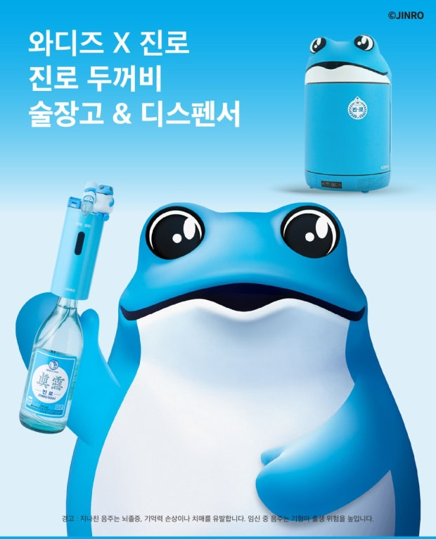
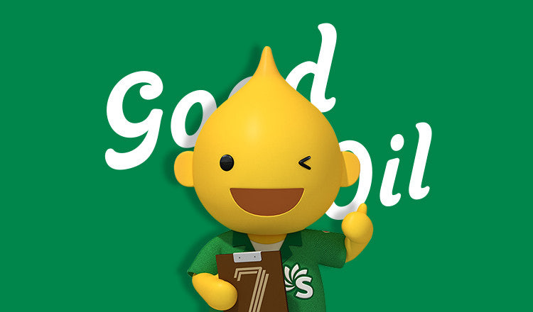
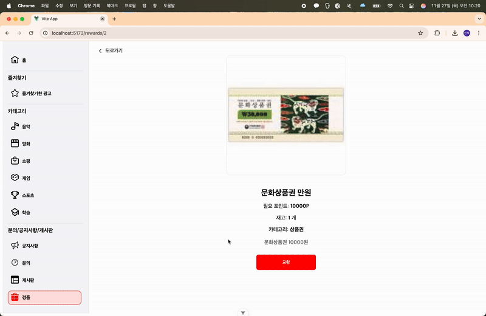
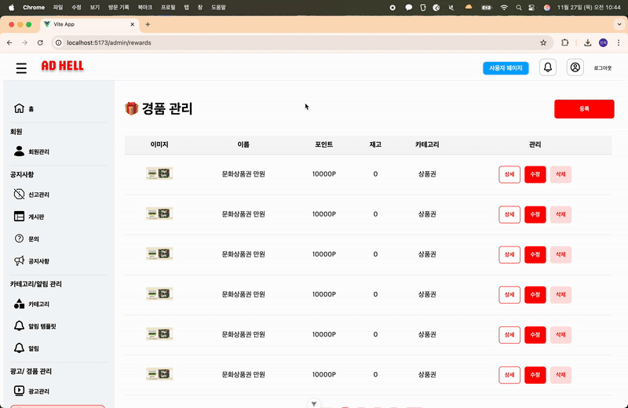
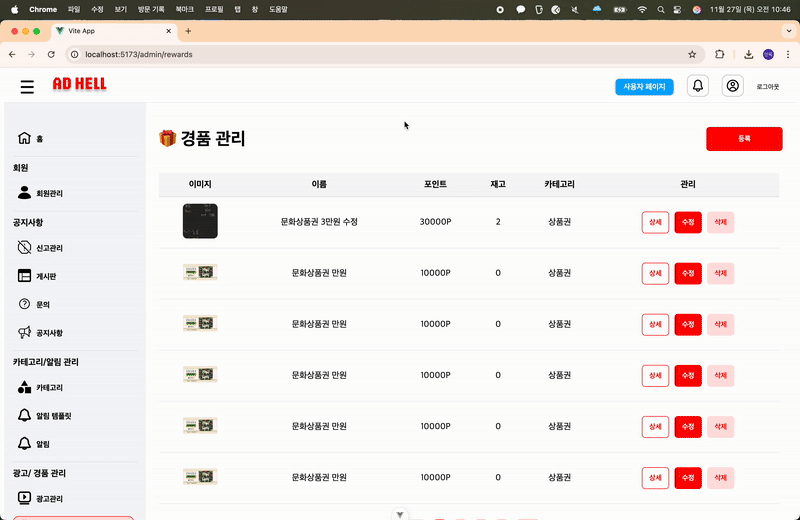
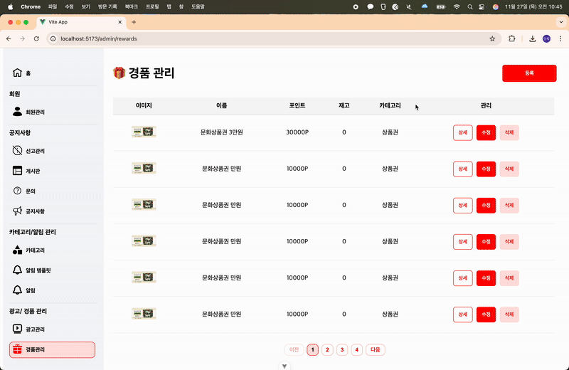
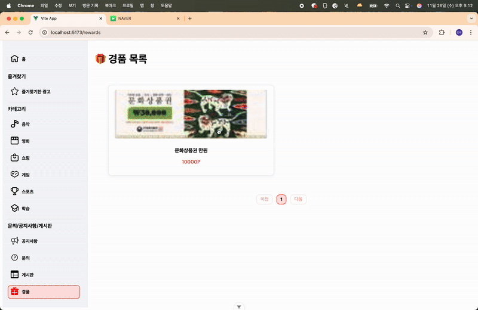
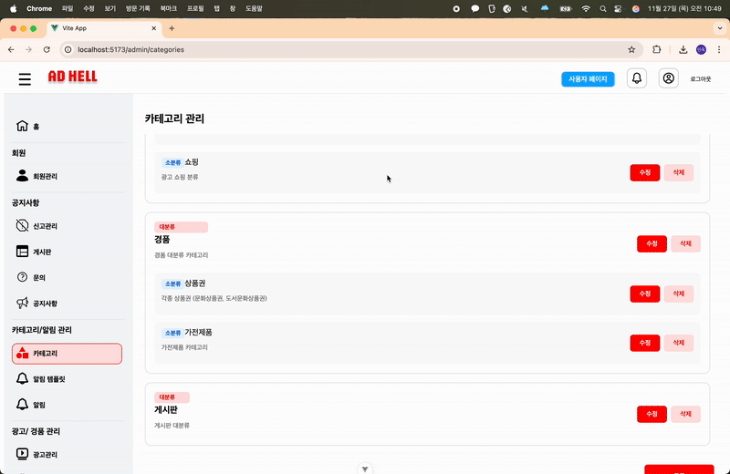
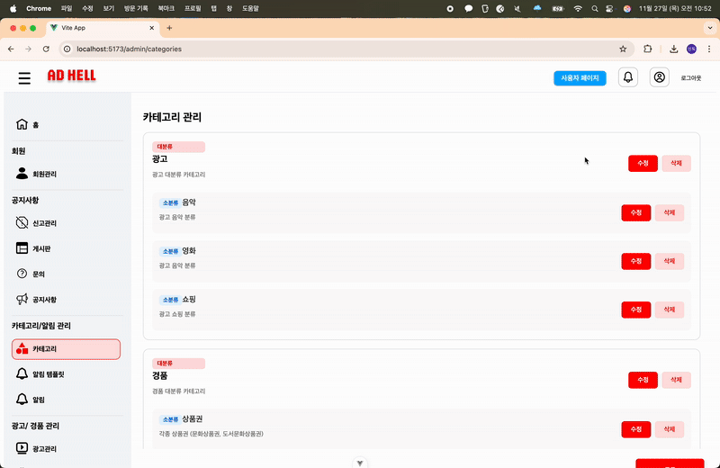

<div align="center">
<h2>광고를 소비하는 가장 똑똑한 방법, AD Hell </h2> <h3>ADHD: 광고당했다 서비스의 모든 UI/UX를 책임지는 프론트엔드</h3> </div>

<br><br>

## 🔍 목차
<table> <tr><td>
1️⃣ <a href="#overview">📌 프로젝트 개요</a><br>
2️⃣ <a href="#tech">🛠️ 기술 스택</a><br>
3️⃣ <a href="#structure">📂 프로젝트 구조</a><br>
4️⃣ <a href="#figma">🎨 화면 설계서 (Figma)</a><br>
5️⃣ <a href="#api">🔗 기능 명세서</a><br>
6️⃣ <a href="#test">🧪 시연 / 기능 테스트 </a><br>
7️⃣ <a href="#trouble">⚡ 트러블슈팅 </a><br>
8️⃣ <a href="#review">👨‍👩‍👧‍👦 팀원 회고</a><br>

</td></tr> </table><br>
<h2 align="center"><em><strong><a href="https://github.com/beyond-sw-camp/be20-2nd-AD-HELL-BUNDLE-API">  💁 Backend 레포지토리 바로가기</a></strong></em></h2>
<br>

## 👤 **팀원 소개**

<table style="width: 100%; text-align: center;">
<tr>
<td align="center"> <a href="https://github.com/zkvn99">이민욱</a></td>
<td align="center"> <a href="https://github.com/kim100000000">김성태</a></td>
<td align="center"> <a href="https://github.com/ChAnGMiNBae">배창민</a></td>
<td align="center"> <a href="https://github.com/okok02110211">강성현</a></td>
<td align="center"> <a href="https://github.com/Hyennnn">정혜인</a></td>
</tr>
<tr>
<td align="center">
    
</td>
<td align="center">
    
</td>
<td align="center">
    
</td>
<td align="center">
    
</td>
<td align="center">
    
</td>
</tr>
</table>

<br><br>
<h1 id="overview">📌 1. 프로젝트 개요</h1>

<div align="center">
  
### ⚡ **ADHD: 광고당했다 — Frontend Client**

<p style="max-width: 800px; font-size: 17px">
<strong>AD Hell Frontend</strong>는 광고 리워드 플랫폼  
<strong style="color:#ff4646">“ADHD: 광고당했다”</strong>의 모든 화면·상태·UX 흐름을 담당하는  
<strong>웹 프론트엔드 애플리케이션</strong>입니다.
</p>

</div>

---

## 💡 **프로젝트 소개**

> ✔ **ADHD: 광고당했다(AD HELL)** 은 기업이 제공하는 광고를 모아  
> 사용자가 시청하면 <strong style="color:#FF3636">포인트 보상</strong>을 제공하는  
> 신개념 <strong>보상형 광고 플랫폼</strong>입니다.

사용자는 광고를 보는 만큼 보상을 얻고,  
광고주는 실제 시청 데이터를 기반으로 효율적인 마케팅이 가능합니다.

---

## 🧩 **기획 배경**

<div style="background:#FFF4F4; padding:18px; border-radius:10px; border-left:6px solid #ff5c5c;">
오늘날 광고는 이미 과잉 상태.  
사용자는 광고를 스킵하고, 광고주는 실효성 데이터를 얻기 어려움
</div>

<br/>

그래서 우리는 질문했습니다.

### 👉 <strong>“사용자도 즐겁고, 광고주도 만족하는 광고 구조는 없을까?”</strong>

그 답이 바로 **ADHD: 광고당했다** 입니다.

---

## 🚀 **서비스 차별점**

<table>
<tr>
<td width="50%">

### 🔻 기존 광고 플랫폼
- 광고가 웹/SNS/앱 등 **분산됨**
- 사용자 **동기 없음**, 시청 피로 증가
- 광고 차단·스킵 빈번
- 실질적 데이터 부족

</td>
<td width="50%">

### 🔺 ADHD: 광고당했다
- 기업 광고를 **한 곳에 모은 전용 플랫폼**
- 광고 시청 시 **포인트 보상**
- 즐겁게 소비 가능한 **보상 기반 구조**
- 참여·시청 패턴 기반 **맞춤 광고**

</td>
</tr>
</table>

---


<br>

<!-- SECTION: 기술 스택 -->
<h1 id="tech">🛠️ 2. 기술 스택</h1>

<br/>

## 🎨 **Frontend**

<div align="left">
  
  
  
  
  
  
</div>

<br/>

## 🔧 **Development Tools**

<div align="left">
  
  
  
  
</div>

<br/><br/>

---

<!-- SECTION: 프로젝트 구조 -->
<h1 id="structure">📂 3. 프로젝트 구조</h1>

<details>
<summary><b>📁 폴더 구조 펼쳐보기</b></summary>

```txt
src/
 ├─ layouts/					# 기본 레이아웃
 │    ├─ DefaultLayout.vue
 │    └─ Sidebar.vue
 │    
 │
 ├─ pages/                      # 라우트와 1:1 매핑되는 페이지
 │    ├─ admin
 │    ├─ advertise
 │    └─ reward
 │
 │
 ├─ components/                 # 재사용 가능한 UI 컴포넌트
 │    ├─ common/                # Element Plus 기반 커스텀 공통 UI
 │    │    ├─ CommonSearchForm.vue
 │    │    ├─ CommonModal.vue
 │    │    ├─ CommonButton.vue
 │    │    └─ CommonPagination.vue
 │    │
 │    └─ features/              # 도메인 전용 UI 조각
 │         ├─ admin/
 │         │    ├─ DetailTable.vue
 │         │    └─ UpdateTable.vue
 │         └─ mypage/
 │              └─ PointHistoryTable.vue
 │
 ├─ composables/                # 재사용 로직(API + 상태 + composable 훅)
 │    └─ reward/
 │          ├─ useRewardDetail.js
 │			└─ useRewardList.js
 ├─ api/                   # API 호출 계층
 │    ├─ api.js
 │    ├─ userApi.js
 │    ├─ boardApi.js
 │    ├─ categoryApi.js
 │    └─ authApi.js
 │
 ├─ router/
 │    └─ index.js
 │
 ├─ store/                      # Pinia 전역 상태
 │    └─ authStore.js
 │
 ├─ utils/                      # 공통 유틸 함수
 │    └─ format.js
 │
 ├─ styles/                     # 전역 스타일 & Element Plus 커스터마이징
 │    └─ css
 │
 └─ assets/                     # 이미지 / 폰트 / 정적 리소스
```
</details>
<br/><br/>

  <h1 id="figma">🎨 4. 화면 설계서 (Figma)</h1>
  <a href="https://www.figma.com/site/FoNABcZyvI0sTu51OpBgaq/ad-hell-design?node-id=3-3&p=f" target="_blank" style="text-decoration: none; color: inherit;">
	  <p>📌 화면설계서 바로가기</p>
  </a>

<br/><br/>

<!-- SECTION: API --> <h1 id="api">🔗 5. API 명세서</h1>

  <a href="https://docs.google.com/spreadsheets/d/16O4Hz9qNTF_cdzcfYx0W3bYIvBDRBE045Gb6kjDid9Q/edit?gid=0#gid=0" target="_blank" style="text-decoration: none; color: inherit;">
	  <p>📌 API 문서 바로가기 </p>
  </a>
<br/><br/>

<!-- SECTION: 테스트 결과 --> <h1 id="test">🧪 6. 기능 테스트 결과</h1>

아래는 실제 서비스 기능을 검증한 시연 영상입니다.

<details> <summary><b>🔐 로그인 / 인증</b></summary> " width="80%"/> </details> 
<details> 
	<summary><b>👤 회원 관리</b></summary> 
	 
</details> 

<details> 
	<summary><b>🔗 카테고리 관리</b></summary> 
	 
	 
	 
	 
	 
</details> 
<details> 
	<summary><b>🎁 경품 관리</b></summary> 
	 
	 
	 
</details> 
<details> <summary><b>📺 광고 관리</b></summary> " width="80%"/> </details>

<br/><br/>

<!-- SECTION: 트러블슈팅 --> <h1 id="trouble">⚡ 7. 트러블슈팅</h1>

아래는 프로젝트 진행 중 실제로 직면했던 문제들과 해결 과정입니다.

🔥 1) Axios Authorization 누락 문제

문제
요청마다 Authorization 헤더가 붙지 않아 인증 실패 발생

원인
Axios 인스턴스 설정 누락 & Refresh Token 처리 순서 문제

해결

인터셉터에서 accessToken 자동 주입

재발급 처리 후 원본 요청 재시도 로직 구축

🔥 2) Pinia 상태변경 무한 리렌더링

문제
watch / computed 안에서 store를 직접 수정해 렌더링 루프 발생

해결

store → 컴포넌트 단방향 흐름 정리

composable 로직 분리로 재사용성과 안정성 확보

🔥 3) Element Plus 컴포넌트 확장 이슈

문제
props 전달 구조가 복잡해져 UI 반응이 꼬임

해결

공통 컴포넌트를 직접 래핑(wrap)

필요한 props만 내려주는 경량 컴포넌트 구성

<br/><br/>

<!-- SECTION: 팀원 회고 --> <h1 id="review">👨‍👩‍👧‍👦 8. 팀원 회고</h1> <div align="center">
이름	회고
	
	
	
</div>

<br/><br/>

