<div align="center">
<h2>광고를 소비하는 가장 똑똑한 방법, AD Hell </h2> <h3>ADHD: 광고당했다 서비스의 모든 UI/UX를 책임지는 프론트엔드</h3> </div>

<br><br>

## 🔍 목차
<table> <tr><td>
1️⃣ <a href="#overview">📌 프로젝트 개요</a><br>
2️⃣ <a href="#tech">🛠️ 기술 스택</a><br>
3️⃣ <a href="#structure">📂 프로젝트 구조</a><br>
4️⃣ <a href="#figma">🎨 화면 설계서 (Figma)</a><br>
5️⃣ <a href="#api">🔗 기능 명세서</a><br>
6️⃣ <a href="#test">🧪 시연 / 기능 테스트 </a><br>
7️⃣ <a href="#trouble">⚡ 트러블슈팅 </a><br>
8️⃣ <a href="#review">👨‍👩‍👧‍👦 팀원 회고</a><br>

</td></tr> </table><br>
<h2 align="center"><em><strong><a href="https://github.com/beyond-sw-camp/be20-2nd-AD-HELL-BUNDLE-API">  💁 Backend 레포지토리 바로가기</a></strong></em></h2>
<br>

## 👤 **팀원 소개**

<table style="width: 100%; text-align: center;">
<tr>
<td align="center"> <a href="https://github.com/zkvn99">이민욱</a></td>
<td align="center"> <a href="https://github.com/kim100000000">김성태</a></td>
<td align="center"> <a href="https://github.com/ChAnGMiNBae">배창민</a></td>
<td align="center"> <a href="https://github.com/okok02110211">강성현</a></td>
<td align="center"> <a href="https://github.com/Hyennnn">정혜인</a></td>
</tr>
<tr>
<td align="center">
    
</td>
<td align="center">
    
</td>
<td align="center">
    
</td>
<td align="center">
    
</td>
<td align="center">
    
</td>
</tr>
</table>

<br><br>
<h1 id="overview">📌 1. 프로젝트 개요</h1>

<div align="center">
  
### ⚡ **ADHD: 광고당했다 — Frontend Client**

</div>

---

## 💡 **프로젝트 소개**

> ✔ **ADHD: 광고당했다(AD HELL)** 은 기업이 제공하는 광고를 모아  
> 사용자가 시청하면 <strong style="color:#FF3636">포인트 보상</strong>을 제공하는  
> 신개념 <strong>보상형 광고 플랫폼</strong>입니다.

사용자는 광고를 보는 만큼 보상을 얻고,  
광고주는 실제 시청 데이터를 기반으로 효율적인 마케팅이 가능합니다.

---

## 🧩 **기획 배경**

<div style="background:#FFF4F4; padding:18px; border-radius:10px; border-left:6px solid #ff5c5c;">
오늘날 광고는 이미 과잉 상태.  
사용자는 광고를 스킵하고, 광고주는 실효성 데이터를 얻기 어려움
</div>

<br/>

그래서 우리는 질문했습니다.

### 👉 <strong>“사용자도 즐겁고, 광고주도 만족하는 광고 구조는 없을까?”</strong>

그 답이 바로 **ADHD: 광고당했다** 입니다.

---

## 🚀 **서비스 차별점**

<table>
<tr>
<td width="50%">

### 🔻 기존 광고 플랫폼
- 광고가 웹/SNS/앱 등 **분산됨**
- 사용자 **동기 없음**, 시청 피로 증가
- 광고 차단·스킵 빈번
- 실질적 데이터 부족

</td>
<td width="50%">

### 🔺 ADHD: 광고당했다
- 기업 광고를 **한 곳에 모은 전용 플랫폼**
- 광고 시청 시 **포인트 보상**
- 즐겁게 소비 가능한 **보상 기반 구조**
- 참여·시청 패턴 기반 **맞춤 광고**

</td>
</tr>
</table>

---


<br>

<!-- SECTION: 기술 스택 -->
<h1 id="tech">🛠️ 2. 기술 스택</h1>

<br/>

## 🎨 **Frontend**

<div align="left">
  
  
  
  
  
  
</div>

<br/>

## 🔧 **Development Tools**

<div align="left">
  
  
  
  
</div>

<br/><br/>

---

<!-- SECTION: 프로젝트 구조 -->
<h1 id="structure">📂 3. 프로젝트 구조</h1>

<details>
<summary><b>📁 폴더 구조 펼쳐보기</b></summary>

```txt
src/
 ├─ layouts/					# 기본 레이아웃
 │    ├─ DefaultLayout.vue
 │    └─ Sidebar.vue
 │    
 │
 ├─ pages/                      # 라우트와 1:1 매핑되는 페이지
 │    ├─ admin
 │    ├─ advertise
 │    └─ reward
 │
 │
 ├─ components/                 # 재사용 가능한 UI 컴포넌트
 │    ├─ common/                # Element Plus 기반 커스텀 공통 UI
 │    │    ├─ CommonSearchForm.vue
 │    │    ├─ CommonModal.vue
 │    │    ├─ CommonButton.vue
 │    │    └─ CommonPagination.vue
 │    │
 │    └─ features/              # 도메인 전용 UI 조각
 │         ├─ admin/
 │         │    ├─ DetailTable.vue
 │         │    └─ UpdateTable.vue
 │         └─ mypage/
 │              └─ PointHistoryTable.vue
 │
 ├─ composables/                # 재사용 로직(API + 상태 + composable 훅)
 │    └─ reward/
 │          ├─ useRewardDetail.js
 │			└─ useRewardList.js
 ├─ api/                   # API 호출 계층
 │    ├─ api.js
 │    ├─ userApi.js
 │    ├─ boardApi.js
 │    ├─ categoryApi.js
 │    └─ authApi.js
 │
 ├─ router/
 │    └─ index.js
 │
 ├─ store/                      # Pinia 전역 상태
 │    └─ authStore.js
 │
 ├─ utils/                      # 공통 유틸 함수
 │    └─ format.js
 │
 ├─ styles/                     # 전역 스타일 & Element Plus 커스터마이징
 │    └─ css
 │
 └─ assets/                     # 이미지 / 폰트 / 정적 리소스
```
</details>
<br/><br/>

  <h1 id="figma">🎨 4. 화면 설계서 (Figma)</h1>
  <a href="https://www.figma.com/site/FoNABcZyvI0sTu51OpBgaq/ad-hell-design?node-id=3-3&p=f" target="_blank" style="text-decoration: none; color: inherit;">
	  <p>📌 화면설계서 바로가기</p>
  </a>

<br/><br/>

<!-- SECTION: API --> <h1 id="api">🔗 5. 기능 명세서</h1>

  <a href="https://docs.google.com/spreadsheets/d/16O4Hz9qNTF_cdzcfYx0W3bYIvBDRBE045Gb6kjDid9Q/edit?gid=0#gid=0" target="_blank" style="text-decoration: none; color: inherit;">
	  <p>📌 기능 명세서 바로가기 </p>
  </a>
<br/><br/>

<!-- SECTION: 테스트 결과 --> <h1 id="test">🧪 6. 기능 테스트 결과</h1>

아래는 실제 서비스 기능을 검증한 시연 영상입니다.

<details> <summary><b>🔐 로그인 / 인증</b></summary> " width="80%"/> </details> 
<details> 
	<summary><b>👤 회원 관리</b></summary> 
	<h4>포인트 이력</h4>
	 
</details> 

<details> 
	<summary><b>🎁 경품 관리</b></summary> 
	<h4>경품등록</h4>
	 
	<br>
	<h4>경품수정</h4>
	 
	<br>
	<h4>경품삭제</h4>
	
	<br>
	<h4>경품 재고 목록 및 등록</h4>
	 
	<br>
	<h4>경품 교환</h4>
	 
	<br>
</details> 
<details> 
	<summary><b>🔗 카테고리 관리</b></summary> 
	<h4>카테고리 등록</h4>
	 
	<br>
	<h4>카테고리 수정</h4>
	 
	<br>
	<h4>카테고리 삭제</h4>
	 
	<br>
</details> 
<details> <summary><b>📺 광고 관리</b></summary> " width="80%"/> </details>
<details> 
	<summary><b>🔔 알림</b></summary> 
	<h4>알림 템플릿 목록 조회</h4>
	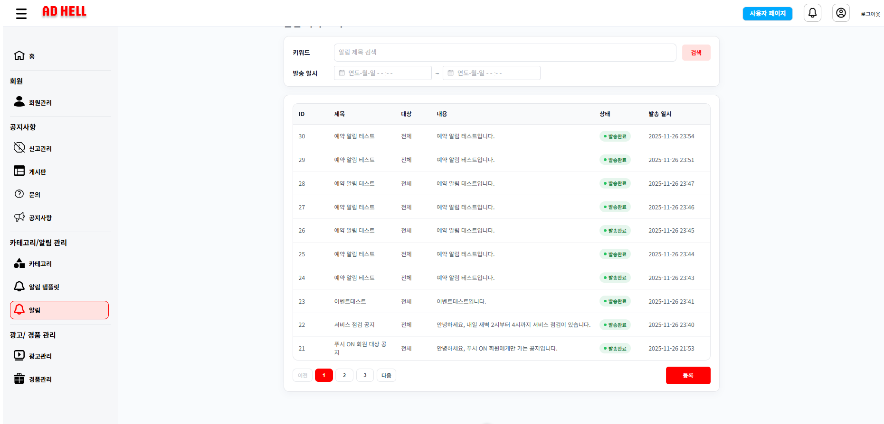
	<h4>알림 템플릿 검색</h4>
	
	<h4>알림 템플릿 등록</h4>
	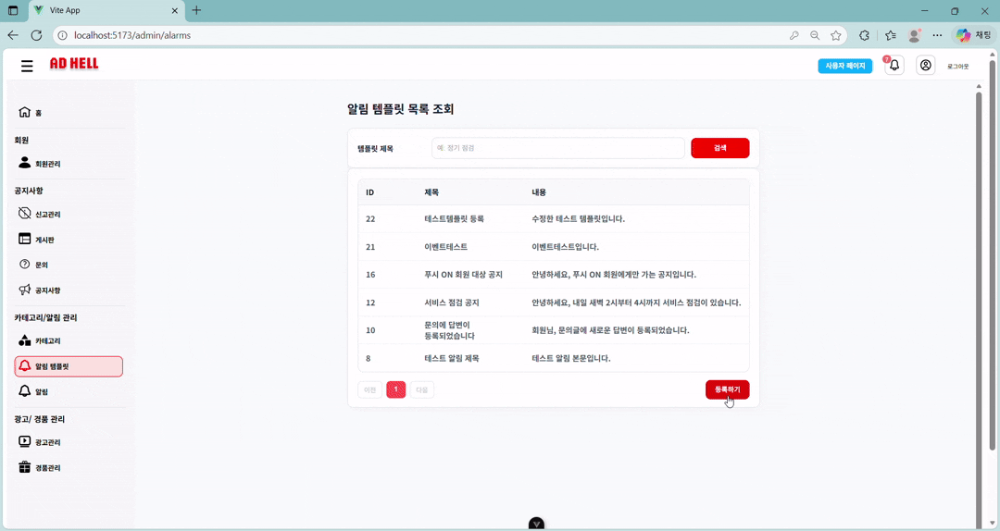
	<h4>알림 템플릿 수정</h4>
	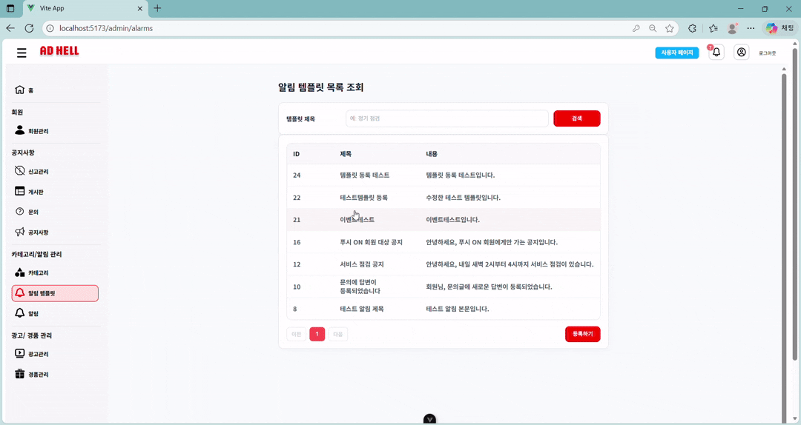
	<h4>알림 템플릿 삭제</h4>
	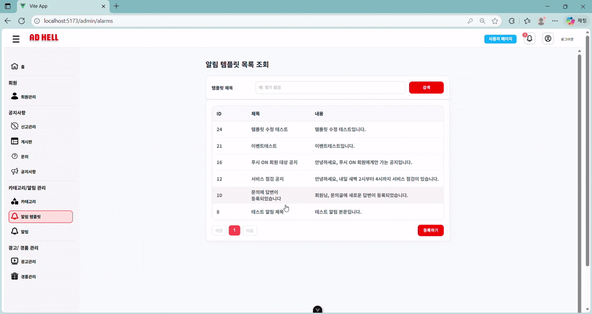
	<h4>알림 발송 목록 조회</h4>
	
	<h4>발송 알림 검색</h4>
	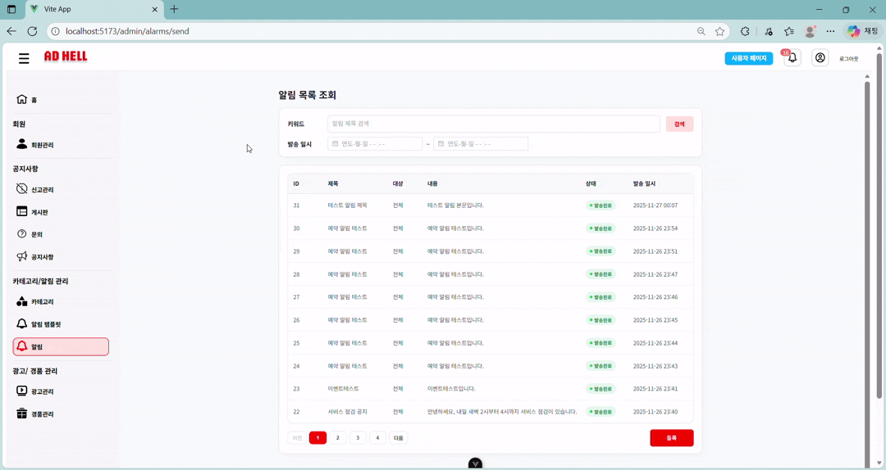
	<h4>즉시 알림 발송</h4>
	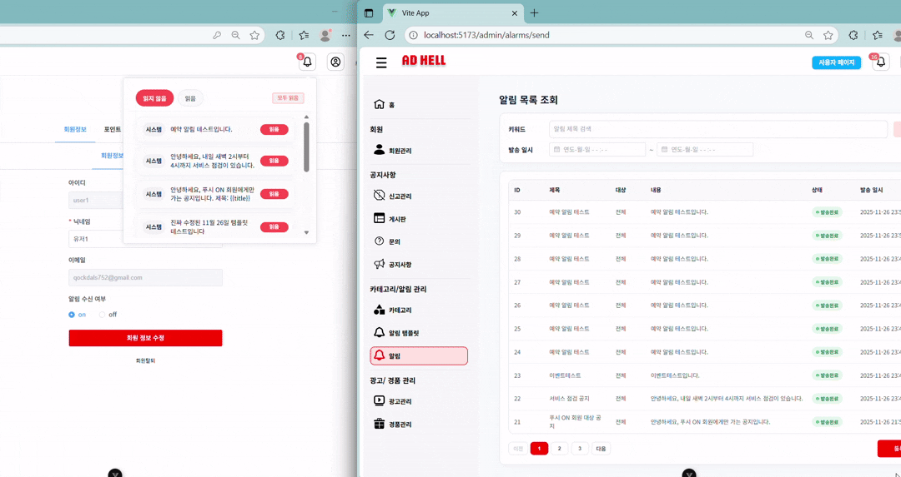
	<h4>푸시 알림 발송</h4>
	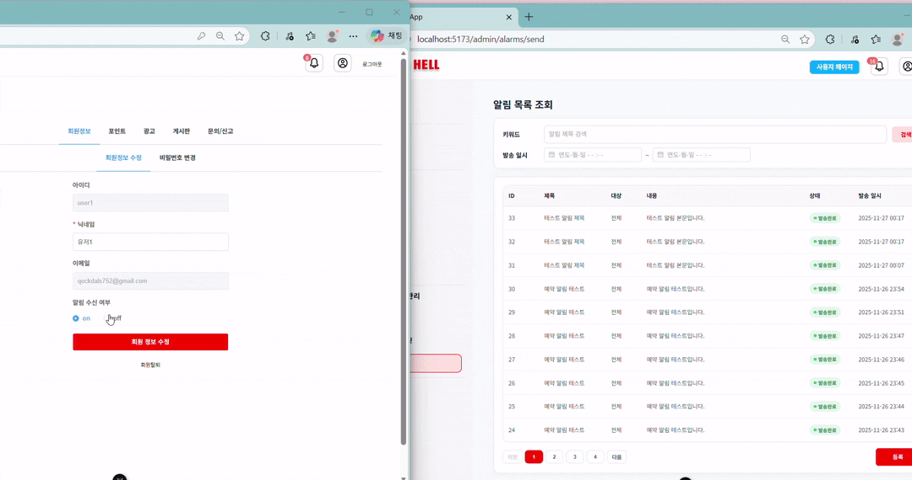
	<h4>이벤트 알림 발송</h4>
	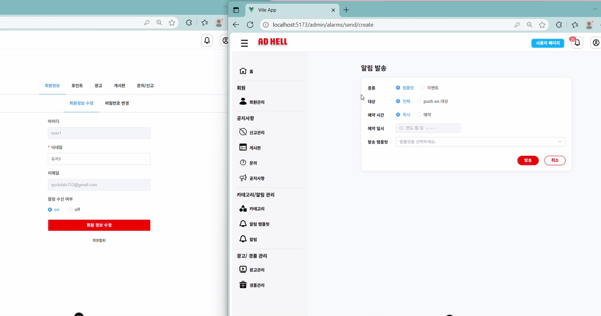
	<h4>예약 알림 발송</h4>
	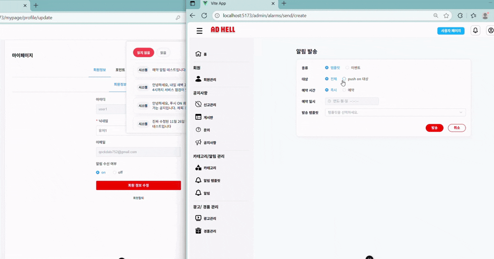
	<h4>알림함</h4>
	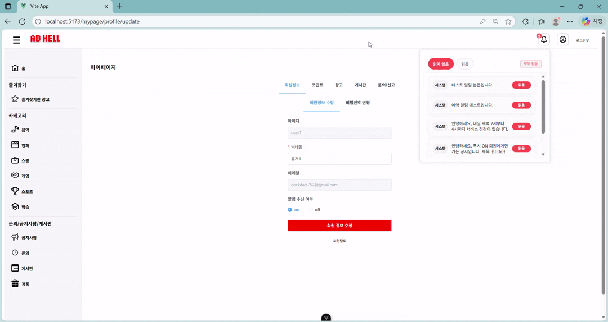
</details>

<details> 
    <summary><b>📺 광고 관리</b></summary>
    <h4>광고 리스트 조회</h4>
    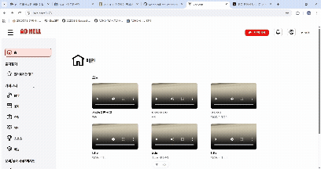 
    <br>
    <h4>모든 광고 리스트 조회</h4>
    
    <br>
    <h4>광고 상세 조회</h4>
    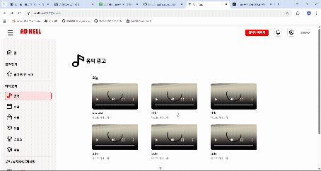
    <br>
    <h4>광고 등록</h4>
    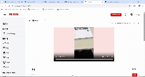
    <br>
    
</details>

<br/><br/>

<!-- SECTION: 트러블슈팅 --> <h1 id="trouble">⚡ 7. 트러블슈팅</h1>
<p>프로젝트 진행 중 실제로 직면했던 핵심 문제들과 해결 과정을 정리했습니다.</p>

<!-- 1번 -->
<h2>🔐 1) Refresh Token 구조 문제 – userId 기반 검증 실패</h2>
<div style="padding:12px; border-left:6px solid #ff6b6b; background:#fff2f2; border-radius:6px;">
  <strong>📌 문제</strong><br>
  Access Token 만료 시 Refresh Token만으로 재발급해야 했으나,<br>
  Redis Key가 <b>userId</b> 기반이라 검증 자체가 불가능한 구조였다.
</div>

<h3>🎯 원인</h3>
<ul>
  <li>Refresh Token에는 <b>loginId</b>만 포함됨</li>
  <li>Redis Key는 <b>userId</b> 기반 저장 → Access Token 없이 loginId 추출 불가</li>
</ul>

<h3>🛠 해결</h3>
<ul>
  <li>Redis Key 구조를 <b>loginId 기반</b>으로 전면 개편</li>
  <li>Refresh Token에서 loginId 추출 후 Redis 검증</li>
  <li>검증된 loginId/role 기반으로 새로운 Access/Refresh 발급</li>
</ul>

<div style="padding:12px; border-left:6px solid #4a90e2; background:#eef5ff; border-radius:6px;">
  <strong>➡️ 개선 효과</strong><br>
  Access Token 없이도 <b>Refresh Token 단독 재발급 가능</b>
</div>

<br>

<!-- 2번 -->
<h2>📨 2) 이메일 인증 – Element Plus Validation 미작동</h2>
<div style="padding:12px; border-left:6px solid #6b8cff; background:#f0f3ff; border-radius:6px;">
  <strong>📌 문제</strong><br>
  이메일 형식 검증 rules가 동작하지 않아 오류 메시지가 표시되지 않음.
</div>

<h3>🎯 원인</h3>
<ul>
  <li><code>:model</code> 속성이 누락되어 validation 대상 필드를 인식하지 못함</li>
</ul>

<h3>🛠 해결</h3>
<ul>
  <li><code>&lt;el-form :model="form"&gt;</code> 명시</li>
  <li><code>v-model="form.email"</code>로 필드 연결</li>
  <li>전체 Form 구조 정상 확인</li>
</ul>

<div style="padding:12px; border-left:6px solid #3b7cff; background:#eaf0ff; border-radius:6px;">
  <strong>➡️ 개선 효과</strong><br>
  Element Plus 검증 정상 작동
</div>

<br>

<!-- 3번 -->
<h2>♻️ 3) 광고 무한 스크롤 – JOIN으로 인한 페이징 중복 오류</h2>
<div style="padding:12px; border-left:6px solid #00b894; background:#eafff4; border-radius:6px;">
  <strong>📌 문제</strong><br>
  광고 1개에 이미지 2개가 있어 JOIN 시 광고가 중복되어 페이징이 틀어지는 문제 발생.
</div>

<h3>🎯 원인</h3>
<ul>
  <li>이미지 개수만큼 광고 row 중복 생성</li>
  <li><code>count</code> 및 <code>hasNext</code> 계산 오류</li>
</ul>

<h3>🛠 해결</h3>
<ul>
  <li>페이징 기준을 <b>광고 ID</b> 기준으로 변경</li>
  <li>광고 ID를 먼저 페이징 처리</li>
  <li>해당 ID들만 JOIN하여 이미지 조회</li>
</ul>

<div style="padding:12px; border-left:6px solid #00a86b; background:#e9fff2; border-radius:6px;">
  <strong>➡️ 개선 효과</strong><br>
  광고 단위 기준으로 정확한 페이징 구현
</div>

<br>

<!-- 4번 -->
<h2>🔔 4) 알림(SSE) – 로그인 직후 뱃지 숫자 지연 표시</h2>
<div style="padding:12px; border-left:6px solid #ffa801; background:#fff7e6; border-radius:6px;">
  <strong>📌 문제</strong><br>
  로그인 직후 알림 뱃지가 표시되지 않고 SSE 연결 이후에야 표시되는 UX 지연 발생.
</div>

<h3>🎯 원인</h3>
<ul>
  <li>초기 알림 개수를 SSE 이벤트에만 의존</li>
  <li>로그인 직후 SSE 연결 지연 → 뱃지 0으로 보임</li>
</ul>

<h3>🛠 해결</h3>
<ul>
  <li>로그인 성공 시 REST API <b>/notifications/unread-count</b> 즉시 호출</li>
  <li>SSE는 새 알림/읽음 처리 등 실시간 변화만 담당하도록 분리</li>
</ul>

<div style="padding:12px; border-left:6px solid #ff9900; background:#fff2db; border-radius:6px;">
  <strong>➡️ 개선 효과</strong><br>
  로그인 직후 즉시 정확한 뱃지 표시 + 자연스러운 SSE 실시간 갱신
</div>


<br/><br/>

<!-- SECTION: 팀원 회고 --> <h1 id="review">👨‍👩‍👧‍👦 8. 팀원 회고</h1> <div align="center">

<table>
  <colgroup>
    <col>
    <col>
  </colgroup>
  <tr>
    <th>👤 이름</th>
    <th>📝 내용</th>
  </tr>
  <tr>
    <td>이민욱</td>
    <td>이번 프로젝트를 통해 구조와 흐름을 먼저 이해하는 것이 개발의 절반이라는 걸 제대로 배웠다. 중간중간 막히는 부분도 많았지만, 그때마다 팀원들이 서로 도와주며 끝까지 완성할 수 있었다. 기술도 사고 방식도 한 단계 더 성장했다고 느낀다.</td>
  </tr>
  <tr><td>김성태</td><td></td></tr>
  <tr>
	  <td>배창민</td>
	  <td>알림 전반 기능을 구현하면서 처음으로 프론트엔드 프로젝트를 진행하게 되었는데, Vue와 웹 개발 전반에 대해 많이 배울 수 있었다.
		  특히 프론트엔드와 백엔드를 실제로 연동해 보니, 포스트맨으로만 테스트할 때는 보이지 않던 보완점들이 드러나 백엔드 코드까지 함께 수정해야 한다는 것을 깨달았다.
		  MSA 구조와 SSE에 대해서도 실습을 통해 감을 잡을 수 있었고, 팀원들과 협업해 하나의 서비스를 끝까지 구현했다는 점에서 큰 성취감을 느꼈다.
		  다만 시간에 쫓겨 초기 기획했던 기능을 모두 담지 못한 점은 아쉽지만, 이번 경험을 바탕으로 다음 프로젝트에서는 더 능숙하게 임할 수 있을 것이라 생각한다.
	  </td>
  </tr>
  <tr><td>정혜인</td><td></td></tr>
  <tr>
    <td>강성현</td>
    <td>백엔드보다 프론트–백엔드 통합 과정에서 협업의 중요성과, 프론트엔드는 협업 능력·경험이 곧 실력이라는 걸 깨달았다.
        프로젝트 처음부터 끝까지 해보며 프론트 실력 부족을 느끼고, 재사용성·유지보수성·문서화의 가치를 깊이 생각하게 되었다.
    </td>
  </tr>
</table>


	
	
</div>

<br/><br/>

